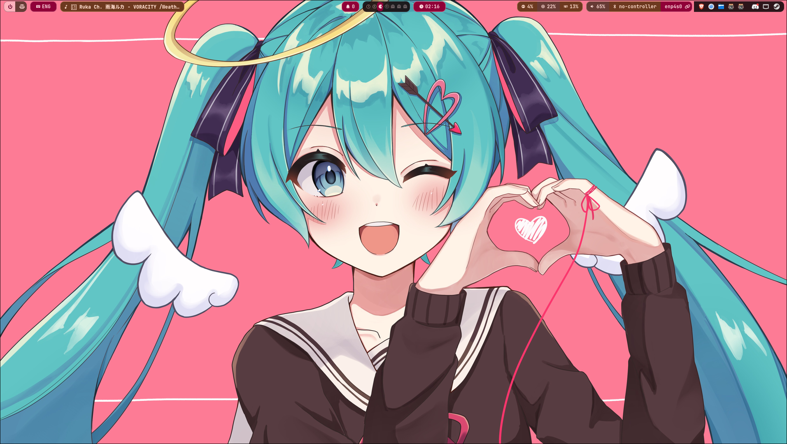
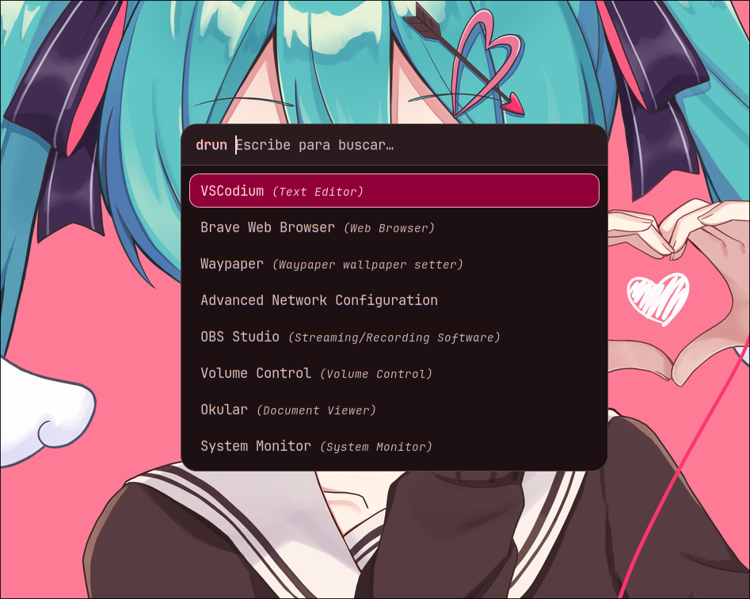
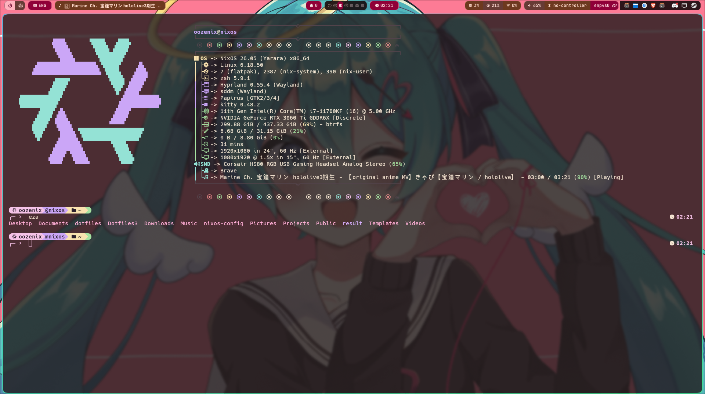
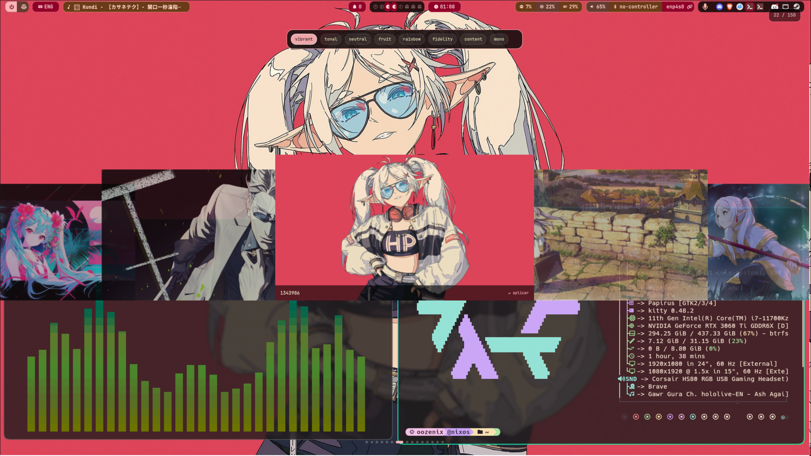
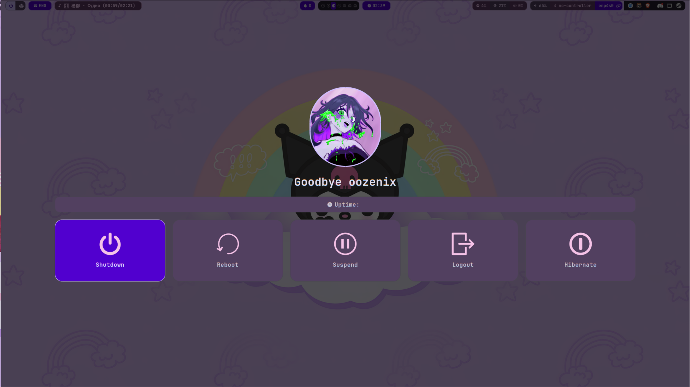

# NixOS Dotfiles

Personal dotfiles for a **NixOS + Hyprland + NVIDIA** desktop environment, focused on customization, theming, desktop utilities, and a lightweight Wayland workflow.

> **⚠️ Important:** This repository contains user-level configuration from my personal system. It is provided as a starting point and will likely need adjustments for different hardware, usernames, paths, monitors, GPUs, or installed packages.

---

## 📋 Requirements

* **NixOS**
* **Hyprland** (configured natively in Lua — see `.config/hypr/hyprland.lua`)
* **NVIDIA GPU** (some environment variables are NVIDIA-specific — AMD/Intel users should review the Hyprland env config before using it unchanged)
* **Wayland**

System-level packages, drivers, and NixOS configuration are maintained in a separate repository: [nixos-config](https://github.com/shizukutakahashi55-del/nixos-config) (see `modules/hyprland.nix`). This dotfiles repo only manages **user-level** config.

---

## 📦 Included

| Component      | Purpose                                          |
|----------------|---------------------------------------------------|
| Hyprland       | Wayland compositor                                |
| Waybar         | Status bar                                        |
| Rofi           | App launcher, Nix search, Bluetooth menu, and power menu |
| SwayNC         | Notification daemon                               |
| SwayOSD        | On-screen volume/brightness overlay               |
| Kitty          | Terminal emulator                                 |
| Yazi           | Terminal file manager (theme generated by Matugen; `dolphin` is the current default file manager) |
| Cava           | Audio visualizer                                  |
| Fastfetch      | System info                                       |
| Matugen        | Dynamic color generation                          |
| Starship       | Shell prompt                                      |
| Zsh            | Shell config                                      |
| OozeShell      | Custom QuickShell-based desktop shell             |
| nix-rofi       | Rofi-based Nix package search                     |
| git-update     | Git commit/push helper                            |

**OozeShell** (custom QuickShell shell) currently includes: a keybinds cheatsheet with a separate **Vim** tab, a monitor picker, a language picker (`SUPER + G`), notifications, and wallpaper switching (shown in screenshots as "WallpaperShell"). MPRIS/media controls exist in the code (`MPRIS/Mpris.qml`) but aren't wired to a Hyprland keybind yet, it works by clicking on the waybar mpris but you can spawnit by adding a bind.

> **Note on the power menu:** the logout/shutdown UI you see in the screenshot is a **Rofi** script (`.config/rofi/Powermenu/`), not the `wlogout` binary. `wlogout` is installed at the system level (see `nixos-config`) but this repo doesn't currently ship a `.config/wlogout/` or wire up its Matugen template — that template file exists but isn't referenced in `matugen/config.toml`.

---

## 🚀 Installation

1. **Clone the repo into your home directory:**

   ```bash
   # SSH
   git clone git@github.com:shizukutakahashi55-del/dotfiles-nix.git ~/dotfiles

   # HTTPS
   git clone https://github.com/shizukutakahashi55-del/dotfiles-nix.git ~/dotfiles

   cd ~/dotfiles
   ```

2. **Review and adapt the configuration before installing.** At minimum, check:

   * Username and paths (see [User-Specific Paths](#-user-specific-paths))
   * NVIDIA / GPU environment variables
   * Monitor configuration
   * Keyboard layout and input settings
   * Wallpaper paths
   * Startup applications and keybindings
   * Fonts and Matugen configuration

3. **Run the installer:**

   ```bash
   chmod +x setup-permissions.sh
   ./setup-permissions.sh
   ```

   This creates the required directories, symlinks the config folders and `.zshrc`, links `nix-rofi` into `~/.local/bin`, and sets executable permissions on the scripts it manages.

   Resulting links look like:

   ```text
   ~/.config/cava          -> ~/dotfiles/.config/cava
   ~/.config/fastfetch     -> ~/dotfiles/.config/fastfetch
   ~/.config/hypr          -> ~/dotfiles/.config/hypr
   ~/.config/kitty         -> ~/dotfiles/.config/kitty
   ~/.config/matugen       -> ~/dotfiles/.config/matugen
   ~/.config/rofi          -> ~/dotfiles/.config/rofi
   ~/.config/swaync        -> ~/dotfiles/.config/swaync
   ~/.config/swayosd       -> ~/dotfiles/.config/swayosd
   ~/.config/waybar        -> ~/dotfiles/.config/waybar
   ~/.config/yazi          -> ~/dotfiles/.config/yazi
   ~/.config/starship.toml -> ~/dotfiles/.config/starship.toml
   ~/.zshrc                -> ~/dotfiles/.zshrc
   ~/.local/bin/nix-rofi   -> ~/dotfiles/nix-rofi
   ~/.config/quickshell"   -> ~/dotfiles/.config/quickshell
   ~/.config/VK-Th"        -> ~/dotfiles/.config/Vesktop/Themes
   ```

   > **⚠️ The installer never overwrites existing files or directories** — existing targets are skipped. Back up your current config first if you want a clean install (see [Troubleshooting](#️-troubleshooting)).

   > **⚠️ Known gap:** `setup-permissions.sh` does **not** currently symlink or `chmod +x` `git-update`. Until that's added to the script, either run it directly from the repo (`~/dotfiles/git-update -Your message`) or add the symlink yourself:
   > ```bash
   > ln -s ~/dotfiles/git-update ~/.local/bin/git-update
   > chmod +x ~/dotfiles/git-update
   > ```

4. **Make sure `~/.local/bin` is in your `$PATH`.** If `nix-rofi` (or `git-update`, once linked) isn't found after install, add this to `.zshrc` and reload:

   ```bash
   export PATH="$HOME/.local/bin:$PATH"
   source ~/.zshrc
   ```

Because the installer uses symlinks, editing files under `~/.config/hypr/` (for example) directly edits `~/dotfiles/.config/hypr/` — there's nothing to "sync," changes are already in the repo.

---

## 🔄 Daily workflow: editing, updating, and publishing changes

**To pull the latest changes:**

```bash
cd ~/dotfiles
git pull
git status                 # sanity check
./setup-permissions.sh     # only needed if a script's executable bit needs restoring
```

**To publish your own changes:**

1. Edit whatever you need under `~/dotfiles/.config/...` (or via the symlinked `~/.config/...` paths).
2. Stage your changes:

   ```bash
   cd ~/dotfiles
   git add .
   ```

3. If you changed or added any scripts, re-run the installer so permissions stay correct:

   ```bash
   ./setup-permissions.sh
   ```

4. Commit and push with `git-update`:

   ```bash
   git-update -Updated Hyprland configuration
   ```

`git-update` is **not tied to `~/dotfiles`** — it detects the repository root from your current directory, so it works from any Git repo (as an easy helper for git), including subdirectories:

```bash
cd ~/dotfiles/.config/hypr
git-update -Updated keybinds
```

Once `~/.local/bin` is in `$PATH` (and `git-update` is linked there — see the note in [Installation](#-installation)), Git also recognizes it as `git update -Updated dotfiles`.

---

## 🛠️ Utilities

**`nix-rofi`** — Rofi-based Nix package search. After install, run it with `nix-rofi` (symlinked from `~/dotfiles/nix-rofi` to `~/.local/bin/nix-rofi`). It's also bound to `SUPER + U` in Hyprland. It depends on the `nix-search` CLI being installed; if it's missing, only this script/keybind is affected, nothing else depends on it.

**`git-update`** — see the workflow above. Remember it isn't auto-linked by the installer yet (see the note in [Installation](#-installation)).

---

## 🎨 Waybar Themes

Waybar can be styled two ways — pick one:

* **Matugen (default):** colors are generated dynamically from your wallpaper via a template:

  ```toml
  [templates.waybar]
  input_path  = "~/.config/matugen/templates/waybar.css"
  output_path = "~/.config/waybar/style.css"
  post_hook   = "pkill waybar; sleep 0.3; waybar &>/dev/null &"
  ```

  It uses `~` instead of a hardcoded username, so it works regardless of your system's username.

* **Static themes:** available in `.config/waybar/themes/`. List them with `ls ~/dotfiles/.config/waybar/themes`, and switch with `./.config/waybar/themes/waybar-theme-switcher.sh`.

These two are mutually exclusive — the Matugen template writes to the same `~/.config/waybar/style.css` a static theme uses, so it will keep overwriting the static theme's stylesheet. **To use a static theme, comment out the `[templates.waybar]` block above in your Matugen config, then restart Waybar.**

Matugen also themes Rofi, SwayNC, SwayOSD, Cava, Starship, Yazi, and part of the Hyprland color config (`modules/appearance/colors.lua`) the same way — each has its own `[templates.*]` block in `matugen/config.toml`.

---

## 🖼️ Wallpapers

Some configs expect wallpapers in `$HOME/Pictures/Wallpapers` (this is what OozeShell's wallpaper picker reads by default):

```bash
mkdir -p ~/Pictures/Wallpapers
```

If you use a different directory, update the corresponding path in `.config/hypr/OozeShell/WALLS/Walls.qml`.

---

## 🔍 User-Specific Paths

Every config in this repo currently uses `~` / `$HOME` rather than a hardcoded username or absolute path, so there's usually nothing to substitute here. The only place my own username shows up is as a cosmetic string in the installer's banner text (`setup-permissions.sh`) — safe to leave, or change if you want the install output to say your own name:

```bash
grep -RIn --exclude-dir=.git 'oozenix' ~/dotfiles
```

Still worth reviewing manually: NVIDIA/GPU settings, monitor config, keyboard layout, the wallpaper folder, startup apps, keybindings, and which apps (`programs.lua`) get used as your terminal/file manager/launcher.

---

## 📁 Repository Structure

```text
╭─ 󰅂  dotfiles/
 
├──  .config
│   ├──  cava/
│   ├──  fastfetch/
│   ├──  hypr/
│   │   ├──  hyprland.lua
│   │   └──  modules/
│   │       ├──  appearance/
│   │       ├──  hardware/
│   │       ├──  input/
│   │       ├──  rules/
│   │       ├──  startup/
│   │       └──  system/
│   ├──  kitty/
│   ├──  matugen/
│   ├──  quickshell/
│   │   ├──  OozeShell/    #Hyprland Version
│   │   │   ├──  Keybinds/
│   │   │   ├──  LANG/
│   │   │   ├──  MONITOR/
│   │   │   ├──  MPRIS/    #Working on click waybar/ still improving
│   │   │   ├──  NOTIFY/
│   │   │   ├──  shell.qml
│   │   │   └──  WALLS/
│   │   └──  OozeShell-KDE/
│   │       ├──  binds.sh
│   │       ├──  Keybinds/
│   │       ├──  LANG/
│   │       ├──  lang.sh
│   │       ├──  launcher.sh
│   │       ├──  oozerunner.sh
│   │       ├──  pmenu-kde.sh
│   │       ├──  shell.qml
│   │       ├──  WALLS/
│   │       └──  walls.sh
│   ├──  rofi
│   ├──  starship.toml
│   ├──  swaync
│   ├──  swayosd
│   ├──  VK-Th/
│   ├──  waybar/
│   │   └──  themes/
│   │       ├──  catppuccin-mocha.css
│   │       ├──  ..........
│   │       └──  waybar-theme-switcher.sh
│   └──  yazi/
│ 
├── 󱆃 .zshrc
├── 󰡯 git-update
├── 󰡯 nix-rofi
├── 󰂺 README.md
├──  screenshots
└──  setup-permissions.sh
```

---

## 🖼️ Screenshots

| Desktop | Rofi | Kitty |
|---|---|---|
|  |  |  |

| Waybar | WallpaperShell | Wlogout |
|---|---|---|
|  |  |  |

---

## 🗑️ Removing the Dotfiles

Everything is symlinked, so removing links doesn't delete the repo. Verify a path is one of this repo's links before removing it:

```bash
readlink -f ~/.config/hypr
# expect: /home/<your-user>/dotfiles/.config/hypr
```

Then remove what you want:

```bash
rm ~/.config/cava ~/.config/fastfetch ~/.config/hypr ~/.config/kitty \
   ~/.config/matugen ~/.config/rofi ~/.config/swaync ~/.config/swayosd \
   ~/.config/waybar ~/.config/yazi ~/.config/starship.toml ~/.zshrc
rm ~/.local/bin/nix-rofi
```

---

## ⚠️ Troubleshooting

**Existing configuration blocks install** — the installer skips existing targets rather than overwriting them.
→ Back up first: `mv ~/.config/hypr ~/.config/hypr.backup`, then re-run `./setup-permissions.sh`.

**Permission denied running the installer**
→ `chmod +x setup-permissions.sh && ./setup-permissions.sh`

**`nix-rofi` not found**
→ Check the link exists (`ls -l ~/.local/bin/nix-rofi`) and that `~/.local/bin` is in `$PATH` (see step 4 of [Installation](#-installation)).

**`git-update` / `git update` doesn't work**
→ The installer doesn't link `git-update` yet — see the note in [Installation](#-installation). Once linked, `which git-update` should resolve to `~/.local/bin/git-update`.

**Nix Search keybind (`SUPER + U`) does nothing**
→ It depends on the `nix-search` CLI. Check with `which nix-search`; if empty, install it or ignore the keybind — nothing else depends on it.

**A static Waybar theme keeps getting overwritten**
→ See [Waybar Themes](#-waybar-themes) — the Matugen template is still active and rewriting `style.css`. Comment it out and restart Waybar.

---

## 🖥️ NixOS Configuration

System-level concerns (packages, NVIDIA drivers, services, hardware config) live in the separate [nixos-config](https://github.com/shizukutakahashi55-del/nixos-config) repo, keeping the two maintained independently.

---

## 📜 License

Personal configuration files. Use, modify, and adapt them as you wish.