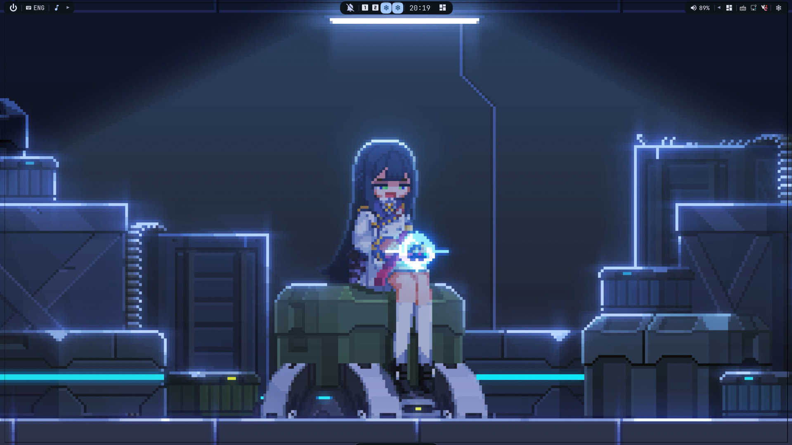
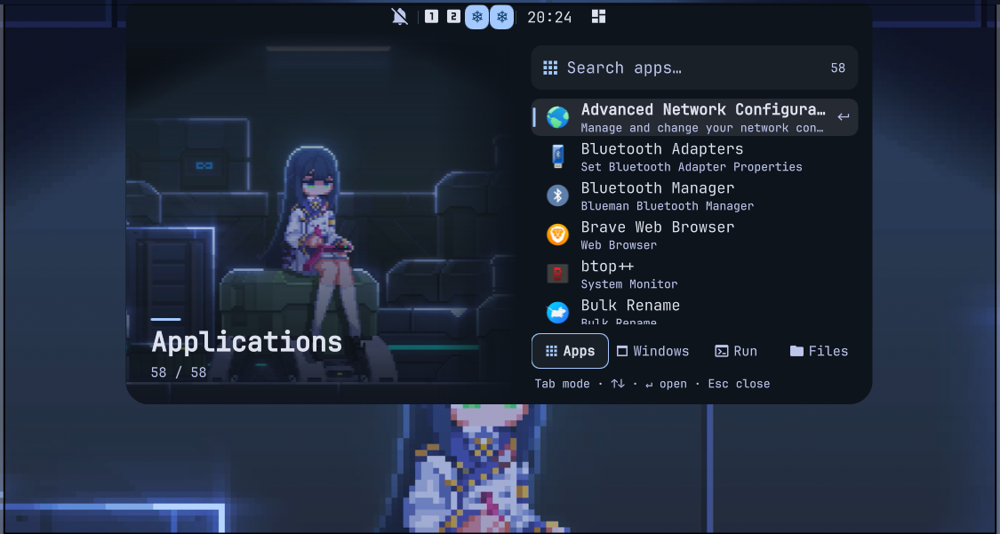
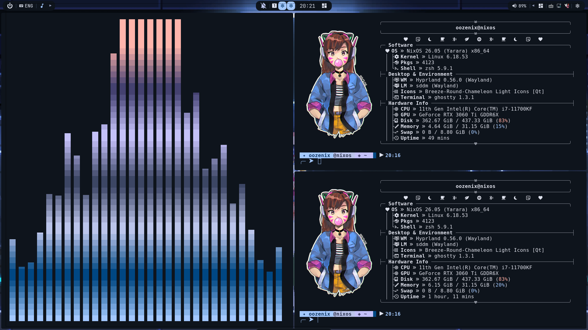
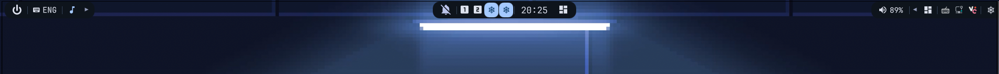
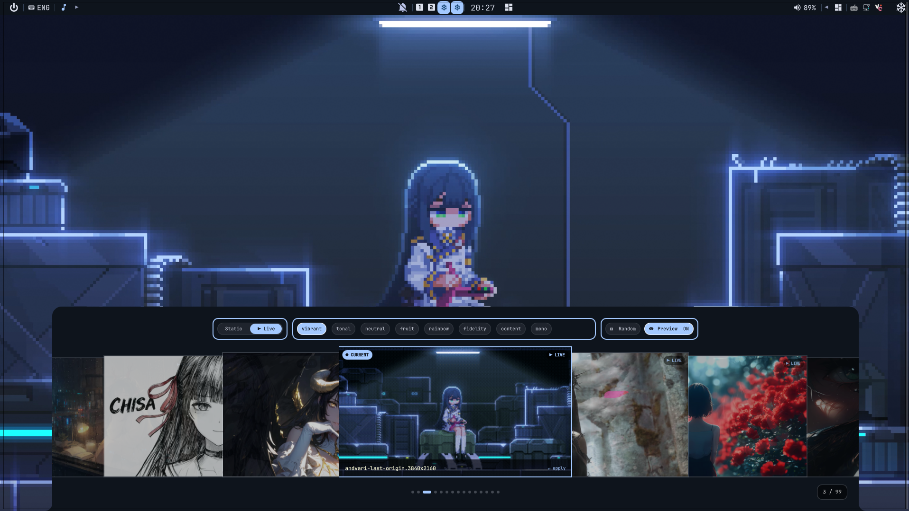
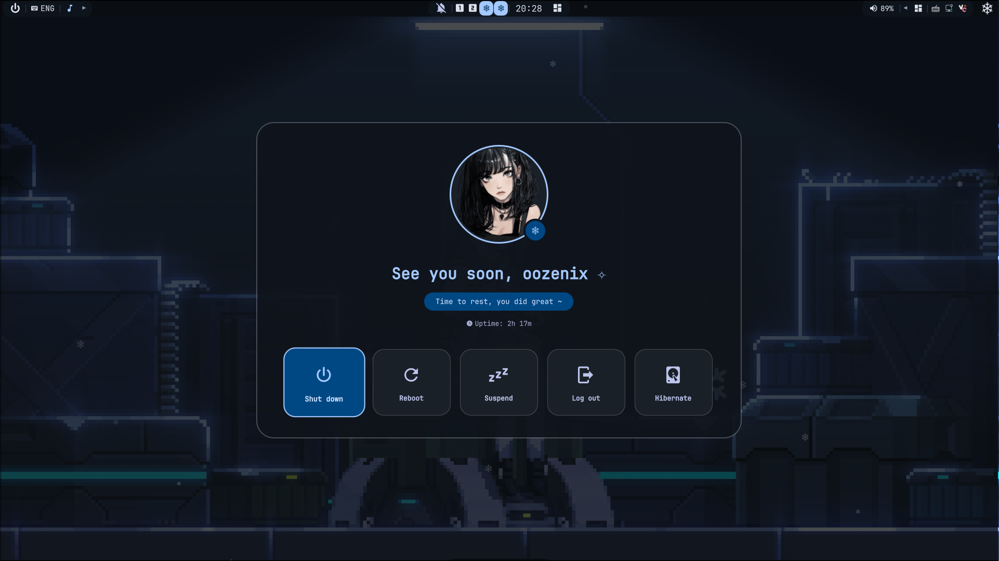

# Oozenix Dotfiles Beta

Personal dotfiles for a **Hyprland** Wayland desktop on **NixOS** (main target) and **Arch Linux**, centered around **OozeShell**, a custom **Quickshell / Qt6** desktop shell.

OozeShell replaces the bar, launcher, notification center, lock screen, wallpaper selector, dock, media controls, power menu and most system panels with a single, themeable shell. 

> **⚠️ Important:** This repository contains user-level configuration from my personal system. It is a starting point and may need adjustments for your hardware, usernames, monitors, GPU, paths and installed packages (the Hyprland config is written for an NVIDIA machine).

> **💡 NixOS users:** the easiest path is to combine these dotfiles with my system configuration: [nix-home](https://github.com/shizukutakahashi55-del/nix-home). It already provides every package, service and font that OozeShell needs.

---

## 📑 Table of contents

* [Supported systems](#-supported-systems)
* [Quick start](#-quick-start)
* [What the installer does](#-what-the-installer-does)
* [Symlinks](#-symlinks-created-by-the-installer)
* [Dependencies](#-dependencies)
* [OozeShell](#-oozeshell)
* [Controlling OozeShell (IPC)](#-controlling-oozeshell-ipc)
* [Dynamic theming](#-dynamic-theming)
* [Wallpapers](#-wallpapers)
* [Legacy configs (Waybar, Rofi, SwayNC, SwayOSD)](#-legacy-configs)
* [Repository structure](#-repository-structure)
* [Screenshots](#-screenshots)
* [Removing the dotfiles](#-removing-the-dotfiles)
* [Troubleshooting](#-troubleshooting)
* [Updating the dotfiles](#-updating-the-dotfiles)
---

## 🖥️ Supported systems

| System                   | Support                                                                                                                          |
| ------------------------ | -------------------------------------------------------------------------------------------------------------------------------- |
| **NixOS**                | Main target. Package search uses `nix-search`.                                                                                   |
| **Arch Linux**           | Supported. The installer installs the dependencies for you. Package search uses pacman + AUR (`paru`/`yay`).                     |
| **Any other distro**     | Not officially supported. The installer treats it as "non-Arch" and generates `NixOSInstallation.md` with the dependency list to adapt by hand. |

---

## 🚀 Quick start

### 1. Clone the repository into `~/dotfiles`

The installer expects the repository to live exactly at `~/dotfiles`.

```bash
# HTTPS
git clone https://github.com/shizukutakahashi55-del/dotfiles-nix.git ~/dotfiles

# SSH
git clone git@github.com:shizukutakahashi55-del/dotfiles-nix.git ~/dotfiles

cd ~/dotfiles
```

### 2. Review the configuration

At minimum, check:

* Username and paths
* NVIDIA / GPU environment variables
* Monitor configuration (`hypr/modules/hardware`)
* Keyboard layout and input settings
* Wallpaper directory
* Startup applications and keybindings
* Terminal choice

Most paths use `$HOME` or `~`, so no hardcoded username should be needed.

### 3. Run the installer

```bash
chmod +x install-oozenix.sh
./install-oozenix.sh
```

> Run it as your **normal user**, not as root. The installer refuses to run as root; `sudo` is used only where needed.

### 4. Start OozeShell

```bash
quickshell -c OozeShell
```

Normally Hyprland starts it for you from its startup module. On Arch the installer prints the command above when it finishes.

---

## 🧰 What the installer does

`install-oozenix.sh` is interactive and asks before doing anything invasive.

**Common steps**

1. Checks that it is not running as root and that `~/dotfiles` exists.
2. Asks **"Are you using Arch Linux?"**
3. Uses `OozeShell.zip` from `~/dotfiles`. It is a single build for every system: at startup OozeShell detects the distro (Arch / NixOS) and the compositor (Hyprland / MangoWM / Niri) by itself.
4. Extracts it into `~/dotfiles/.config/quickshell/OozeShell`. An existing `OozeShell` folder is **moved** to `OozeShell.bak-<timestamp>`, never deleted.
5. Asks whether to also set up the legacy tools (swaync, waybar, swayosd, wlogout, rofi).
6. Creates the symlinks and sets executable permissions (see below).

**Arch branch**

* Detects `paru` or `yay`; offers to install `paru` if neither exists.
* Optionally runs `sudo pacman -Syu`.
* Installs the base dependencies (repo packages via `pacman`, the rest via the AUR helper). If a batch fails it retries package by package and lists everything that failed at the end.
* Installs `quickshell` and `awww` (release or `-git`, whichever is available).
* Lets you choose a terminal: foot, kitty, alacritty, wezterm or ghostty (or "already installed").
* Optionally enables the `NetworkManager`, `bluetooth` and `power-profiles-daemon` services.
* Optionally installs the legacy tools and an **extras bundle** (dev tools, gaming, utilities). `greetd` and `rtkit` are installed but **not** configured.
* Installs the pixel-font fallback config (`99-oozeshell-pixel.conf`) into `~/.config/fontconfig/conf.d/` and refreshes the font cache.

**Non-Arch / NixOS branch**

* Extracts `OozeShell.zip` (if `unzip` is missing, it can open a temporary `nix-shell -p unzip`; nothing permanent is installed).
* Writes `~/dotfiles/NixOSInstallation.md` with the full dependency list, phrased as "what you need available" rather than exact Nix attribute names.
* Links `nix-rofi` into `~/.local/bin`.
* Does **not** install packages. Use [nix-home](https://github.com/shizukutakahashi55-del/nix-home) or your own Nix configuration for that.

---

## 🔗 Symlinks created by the installer

Always linked:

```text
~/.config/alacritty
~/.config/cava
~/.config/fastfetch
~/.config/foot
~/.config/ghostty
~/.config/hypr
~/.config/kitty
~/.config/matugen
~/.config/nvim
~/.config/quickshell
~/.config/wezterm
~/.config/yazi
~/.config/starship.toml

~/.config/Vesktop/Themes   -> ~/dotfiles/.config/VK-Th
~/.zshrc
```

Only when you answer **yes** to the legacy tools question:

```text
~/.config/rofi
~/.config/swaync
~/.config/swayosd
~/.config/waybar
```

Only on the **non-Arch (NixOS)** branch:

```text
~/.local/bin/nix-rofi      -> ~/dotfiles/nix-rofi
```

Example:

```text
~/.config/hypr        -> ~/dotfiles/.config/hypr
~/.config/quickshell  -> ~/dotfiles/.config/quickshell
```

Because everything is a symbolic link, editing `~/.config/hypr/` actually edits `~/dotfiles/.config/hypr/`. There is no sync step.

### Existing files and links

| Situation at the target                              | What the installer does                                                         |
| ---------------------------------------------------- | ------------------------------------------------------------------------------- |
| Nothing there                                        | Creates the link.                                                               |
| Already a link to the right place                    | Leaves it alone.                                                                |
| A link pointing somewhere else                       | Replaces the link.                                                              |
| A real file or directory                             | **Asks** whether to move it to `<target>.bak-<timestamp>` and link the dotfiles version. Answer `n` to keep yours (that item is skipped). |

### Executable permissions

The installer runs `chmod +x` on:

* `OozeShell/OozeAudio/backend/audio.sh`
* `nix-rofi` (NixOS branch only)
* If legacy tools were enabled: the Rofi launcher / powermenu / bluetooth scripts and `waybar-theme-switcher.sh`

### `git-update`

`git-update` is in the repository but is **not** linked automatically. Install it manually:

```bash
chmod +x ~/dotfiles/git-update
ln -s ~/dotfiles/git-update ~/.local/bin/git-update
```

Make sure `~/.local/bin` is in your `PATH`:

```bash
export PATH="$HOME/.local/bin:$PATH"
```

---

## 📦 Dependencies

On **Arch** the installer takes care of all of this. On **NixOS** use [nix-home](https://github.com/shizukutakahashi55-del/nix-home) or the generated `NixOSInstallation.md`.

### Base

| Group           | Packages / tools                                                                                             |
| --------------- | ------------------------------------------------------------------------------------------------------------ |
| Compositor      | `hyprland`, `hyprpaper`, `hypridle`, `hyprlock`, `hyprpolkitagent`, `hyprshot`, `hyprsunset`, `hyprshutdown`, `hyprsysteminfo` |
| Shell framework | `quickshell` (or `quickshell-git`)                                                                           |
| Qt6             | QtQuick, QtQuick.Controls, QtQuick.Layouts, QtQuick.Shapes, QtQuick.Effects, QtQml, `qt6ct` (`qt6-base`, `qt6-declarative`, `qt6-svg`, `qt6-shadertools`) |
| Audio           | `pipewire`, `pipewire-pulse`, `wireplumber` (`wpctl`, `pw-dump`, `pw-link`), `pavucontrol`                   |
| Hardware        | `brightnessctl`, `power-profiles-daemon` (`powerprofilesctl`), `upower`                                      |
| Network / BT    | `networkmanager` (`nmcli`) + applet, `bluez` / `bluez-utils` (`bluetoothd`), `blueman`                       |
| Media           | `playerctl`, `mpv`, `mpvpaper`, `ffmpeg`, `cava`                                                             |
| Wallpaper       | `awww` (successor to `swww`), `imagemagick`                                                                  |
| Theming         | `matugen`                                                                                                    |
| Utilities       | `socat`, `jq`, `wl-clipboard` (`wl-copy`, `wl-paste`), `cliphist`, `xdg-utils`, `libnotify`, `wtype`, `wev`, `grim`, `slurp`, `fastfetch`, `pgrep` |
| Fonts           | **JetBrainsMono Nerd Font**, **Symbols Nerd Font Mono**                                                      |
| Terminal        | One of: foot, kitty, alacritty, wezterm, ghostty                                                             |

### Optional

* **Package search on NixOS**: `nix-search` / `nix-search-cli` and `nix`. If missing, only that panel is affected.
* **Package search on Arch**: uses `pacman` and `paru`/`yay`. No Nix needed. The IPC target is `nixsearch` on every system, so the same keybind works everywhere.
* **Pixel style fonts** for the CoOzey theme: Pixelify Sans, Jersey 10, Silkscreen, VT323, DotGothic16. See `OozeShell/tools/fonts/fonts.nix.example` for a NixOS snippet.
* **Extras bundle** (Arch installer option): yazi, neovim, starship, fd, ripgrep, dolphin, nomacs, lazygit, gh, gamemode, lutris, mangohud, wine, prismlauncher, protonplus, and more.

---

# 🌸 OozeShell

**OozeShell** is the main component of these dotfiles: a Quickshell shell written in QML, built around Hyprland. Everything is shared between surfaces except where noted.

### Interface modes

| Mode              | Description                                                                                       |
| ----------------- | ------------------------------------------------------------------------------------------------- |
| **Bar**           | Classic bar at the **top, bottom, left or right**, optionally **floating**, with optional screen-corner "frame". |
| **Islands**       | No bar background; each popup grows out of its own island.                                        |
| **Pill + Dashboard** | A compact pill (clock, workspaces, taskbar, tray, notifications) that opens a full **Dashboard**. |

Two visual styles are available: **OozeSoft** (flat, thin borders) and **CoOzey** (cozy pixel style), each with light/dark mode.

### Features

* **Bar / Pill / Dock**: taskbar, tray, workspaces, clock, privacy indicators, battery and brightness modules, and a separate floating **Dock** with pinned and running apps (auto-hide, top/bottom position, auto-flips away from a horizontal bar).
* **Dashboard**: overview, performance gauges, audio, calendar, media (MPRIS), power and quick access.
* **Launcher**: modes for **apps**, **windows**, **run** and **files**, with a built-in calculator.
* **Package search**: `nix-search` (NixOS) / pacman + AUR (Arch), chosen automatically. On **Arch** it also has an **Installed** button (or `Ctrl+L`) that lists your pacman + AUR packages, filters as you type and uninstalls them (`Ctrl+R`) after a confirmation, running `pacman -Rns` / `paru -Rns` in a terminal. `Ctrl+E` switches between explicitly installed packages and all (with dependencies). Not available on NixOS.
* **Overview**: workspace overview with live window previews.
* **Notification center** with toasts and Do Not Disturb.
* **Agenda**: calendar with a to-do list and alarms (right-click the clock).
* **Wallpaper selector**: static images and **live video wallpapers** (`mpvpaper`), with palette extraction through Matugen.
* **Media / MPRIS** controls with audio waves.
* **Audio**: output/input selection, sliders, OSD, and **OozeAudio**, a separate window for routing/connections built on PipeWire.
* **Network**, **Bluetooth** and **power profile** menus.
* **Native lock screen (OozeLock)** using `ext-session-lock-v1` and PAM. Replaces `hyprlock`; background is the wallpaper at the moment of locking (or a custom image); includes a Caps Lock indicator.
* **OSDs**: volume/microphone, Caps Lock and keyboard layout.
* **Power menu** (logout, suspend, reboot, shutdown) as a full-screen modal.
* **Screenshots**: area copy, area save and full save.
* **Monitor selector and editor**, with automatic detection of the focused monitor.
* **Keybinds cheatsheet** and Vim shortcuts tab.
* **Advanced Settings**: Profile, General, Hyprland / Monitor, Appearance, Interface, Agenda, Services, Audio and About, with a searchable settings registry.
* **Appearance controls** that generate Hyprland theme files (`autogen/theme.lua`, layout and animation profile: smooth, snappy, playful, minimal, dramatic, dramatic_side).
* **Languages**: English, Español, Bahasa Indonesia, 日本語.
* **Dynamic theming** through Matugen.

### Default keybind integrations

Some functionality is bound in the Hyprland config:

| Keybind     | Function            |
| ----------- | ------------------- |
| `SUPER + I` | Keybinds cheatsheet |
| `SUPER + L` | Monitor picker      |
| `SUPER + G` | Language picker     |
| `SUPER + U` | Package search      |

The exact keybindings may change as OozeShell develops. Check `hypr/modules` for the current ones.

### Lock screen and idle

OozeLock is called from both `hypridle` and a keybind through IPC:

```bash
quickshell ipc -c OozeShell call lock lock
```

### Project layout

```text
OozeShell/
├── shell.qml            # entry point, popups and all IPC handlers
├── BAR/  PILL/  DOCK/  DASHBOARD/  MENU/
├── AUDIO/  BLUETOOTH/  NETWORK/  POWER/  BATTERY/  BRIGHTNESS/  PRIVACY/
├── Launcher/  NixSearch/  OVERVIEW/  NOTIFY/  AGENDA/  MPRIS/
├── WALLS/  LOCK/  CAPS/  SCREENSHOT/  MONITOR/  Keybinds/
├── SETTINGS/  APPEARANCE/  LANG/  COMMON/   # shared theme and widgets
├── OozeAudio/           # standalone audio routing window
├── native/              # AnimationController (C++ helper)
├── assets/fonts/        # bundled Varela Round
└── tools/               # check.sh, fonts
```

To sanity-check the shell after editing (page registry, translations in all four languages, `qmllint`):

```bash
cd ~/.config/quickshell/OozeShell
bash tools/check.sh
```

---

## 🎛️ Controlling OozeShell (IPC)

Everything can be driven from a keybind or a script:

```bash
quickshell ipc -c OozeShell call <target> <function> [args]
```

| Target          | Functions (examples)                                                                         |
| --------------- | -------------------------------------------------------------------------------------------- |
| `bar`           | `position top\|bottom\|left\|right`, `togglePosition`, `floating true\|false`, `toggleFloating`, `islands`, `pill`, `togglePill`, `get` |
| `corners`       | `toggle`, `set true\|false`, `get` (screen-corner frame)                                     |
| `settings`      | `toggle`, `open`, `close`, `get` (opens Advanced Settings)                                   |
| `theme`         | `mode light\|dark`, `toggle`, `style cozy\|soft`, `styleGet`, `softfont`                     |
| `appearance`    | `toggle`, `get`, `set <key> <value>`                                                         |
| `launcher`      | `toggle`, `open <apps\|windows\|run\|files>`, `close`                                        |
| `nixsearch`     | `toggle`, `open <query>`, `installed` (Arch: installed packages), `close`                    |
| `overview`      | `toggle`, `open`, `close`                                                                    |
| `menu` / `network` / `bluetooth` / `mpris` / `keybinds` | `toggle`                                                     |
| `audio`         | `toggle`, `raise`, `lower`, `mute`, `micToggle`, `micRaise`, `micLower`                      |
| `notify`        | `toggle`, `show <text>`, `toggleDnd`, `enableDnd`, `disableDnd`, `isDnd`, `clear`            |
| `agenda`        | `toggle`, `open`, `close`                                                                    |
| `toggleWalls`   | `handle` (wallpaper selector)                                                                |
| `screenshot`    | `areaCopy`, `areaSave`, `fullSave`                                                           |
| `powermenu`     | `toggle`, `open`, `close`                                                                    |
| `clipboard`     | `toggle`, `open`, `close` (clipboard history; needs `wl-clipboard` + `cliphist`)             |
| `lock`          | `lock`, `locked`                                                                             |
| `monitor`       | `set <name\|auto>`, `get`, `current`, `list`, `togglePicker`                                 |
| `lang`          | `set <code>`, `get`, `list`, `togglePicker`                                                  |
| `keyboardlayout`| `next`                                                                                       |
| `caps` / `layoutosd` | `show` (used by Hyprland to trigger the OSDs)                                           |

Example Hyprland binds:

```lua
-- Lock, open the launcher in "run" mode, take an area screenshot
quickshell ipc -c OozeShell call lock lock
quickshell ipc -c OozeShell call launcher open run
quickshell ipc -c OozeShell call screenshot areaCopy
```

---

# 🎨 Dynamic theming

Colors are generated from the current wallpaper with **Matugen**. It can theme Hyprland, OozeShell, Waybar, Rofi, SwayNC, SwayOSD, Cava, Starship, Yazi, Kitty and more.

```text
~/.config/matugen/config.toml        # main configuration
~/.config/matugen/templates/         # templates
```

---

# 🖼️ Wallpapers

OozeShell reads wallpapers from:

```text
~/Pictures/Wallpapers
```

```bash
mkdir -p ~/Pictures/Wallpapers
```

Static wallpapers are set through **awww**. Video wallpapers use **mpvpaper** (with `mpv`, `ffmpeg` and `socat`); Matugen takes its palette from a single extracted frame.

To use another folder, edit `wallpaperFolder` in:

```text
~/.config/quickshell/OozeShell/WALLS/Walls.qml
```

The lock screen wallpaper can be chosen in **Advanced Settings → General** (automatic, or a custom image path).

---

# 🧩 Legacy configs

OozeShell already provides the bar, notifications, launcher and logout menu. The older configs remain in the repository in case you want them separately, and are **only linked if you say yes** to the installer's legacy question:

| Component  | Purpose                               |
| ---------- | ------------------------------------- |
| **Waybar** | Alternative bar                       |
| **Rofi**   | Launcher / utilities                  |
| **SwayNC** | Notification daemon                   |
| **SwayOSD**| Volume / brightness OSD               |
| **wlogout**| Logout menu (installed on Arch; no config is linked) |

### Waybar styling

Waybar can be styled in two mutually exclusive ways.

**Matugen** generates `~/.config/waybar/style.css`:

```toml
[templates.waybar]
input_path  = "~/.config/matugen/templates/waybar.css"
output_path = "~/.config/waybar/style.css"
post_hook   = "pkill waybar; sleep 0.3; waybar &>/dev/null &"
```

**Static themes** live in `.config/waybar/themes/`:

```bash
ls ~/dotfiles/.config/waybar/themes
./.config/waybar/themes/waybar-theme-switcher.sh
```

> **⚠️** Both write to the same `style.css`. To use a static theme, disable the `[templates.waybar]` section in Matugen and restart Waybar.

---

# 📁 Repository structure

```text
dotfiles/
├── .config/
│   ├── alacritty/  cava/  fastfetch/  foot/  ghostty/
│   ├── hypr/
│   │   ├── hyprland.lua
│   │   └── modules/
│   │       ├── appearance/    # includes OozeShell's autogen theme files
│   │       ├── hardware/
│   │       ├── input/
│   │       ├── rules/
│   │       ├── startup/
│   │       └── system/
│   ├── kitty/  matugen/  nvim/
│   ├── quickshell/
│   │   └── OozeShell/         # extracted by the installer
│   ├── rofi/  swaync/  swayosd/   # legacy
│   ├── VK-Th/                 # Vesktop theme
│   ├── waybar/                # legacy
│   │   └── themes/
│   ├── wezterm/  yazi/
│   └── starship.toml
│
├── .zshrc
├── git-update
├── nix-rofi                   # NixOS only
├── install-oozenix.sh         # main installer
├── OozeShell.zip              # single build (Arch + NixOS, all compositors)
├── NixOSInstallation.md       # generated on non-Arch installs
├── screenshots/
└── README.md
```

---

# 🖼️ Screenshots

| Desktop                             | Launcher                              | Ghostty                             |
| ----------------------------------- | ------------------------------------- | ----------------------------------- |
|  |  |  |

| Bar                         | WallpaperShell                                      | OozeLogout                                |
| --------------------------- | --------------------------------------------------- | ----------------------------------------- |
|  |  |  |

---

# 🗑️ Removing the dotfiles

Removing a symlink does **not** delete the repository. Verify the target first:

```bash
readlink -f ~/.config/hypr
# /home/<your-user>/dotfiles/.config/hypr
```

Then remove the links:

```bash
rm ~/.config/alacritty ~/.config/cava ~/.config/fastfetch ~/.config/foot \
   ~/.config/ghostty ~/.config/hypr ~/.config/kitty ~/.config/matugen \
   ~/.config/nvim ~/.config/quickshell ~/.config/wezterm ~/.config/yazi \
   ~/.config/starship.toml ~/.config/Vesktop/Themes ~/.zshrc

# Only if they exist (legacy tools / NixOS branch)
rm -f ~/.config/rofi ~/.config/swaync ~/.config/swayosd ~/.config/waybar
rm -f ~/.local/bin/nix-rofi
```

> **⚠️ Only remove paths that are actually symlinks to this repository.** Backups made by the installer (`*.bak-<timestamp>`) are not touched, so you can restore them by renaming.

---

# ⚠️ Troubleshooting


### `Could not find OozeShell.zip`

The installer looks for `OozeShell.zip` in `~/dotfiles` on every system. Put the file there and run the installer again.

### The installer refuses to run

It will not run as root. Use your normal user account.

### Permission denied

```bash
chmod +x install-oozenix.sh
./install-oozenix.sh
```

### Existing configuration

The installer asks before touching a real file or directory and can back it up as `<target>.bak-<timestamp>`. To start clean by hand:

```bash
mv ~/.config/hypr ~/.config/hypr.backup
./install-oozenix.sh
```

### Some Arch packages were not installed

The installer prints a list at the end. Check the names with:

```bash
pacman -Ss <name>
paru -Ss <name>
```

Packages such as `matugen`, `mpvpaper` and `awww` may only exist in the AUR, so an AUR helper (`paru`/`yay`) is needed.

### OozeShell does not start

```bash
which quickshell
quickshell -c OozeShell
```

If it still fails, verify the [dependencies](#-dependencies) and run `bash tools/check.sh` from the OozeShell folder.

### Icons show as empty squares

Install **JetBrainsMono Nerd Font** and **Symbols Nerd Font Mono**. On Arch the installer copies the fontconfig fallback for you; on NixOS see `OozeShell/tools/fonts/fonts.nix.example`.

### Package search keybind does nothing

* NixOS: check `which nix-search`.
* Arch: check that `pacman` and `paru`/`yay` are available.

This does not affect the rest of OozeShell.

### Wallpaper selector does not find wallpapers

```bash
ls ~/Pictures/Wallpapers
mkdir -p ~/Pictures/Wallpapers
```

For another location, edit `wallpaperFolder` in `.config/quickshell/OozeShell/WALLS/Walls.qml`.

### Hyprland does not pick up appearance changes

OozeShell regenerates files under `hypr/modules/appearance/autogen/`. If Hyprland does not reload them, reload the config manually (`hyprctl reload`); this is a Hyprland reload timing issue, not a Quickshell bug.

### `nix-rofi` or `git-update` not found

```bash
ls -l ~/.local/bin/nix-rofi ~/.local/bin/git-update
echo $PATH
```

`nix-rofi` is only linked on the NixOS branch; `git-update` is never linked automatically (see [git-update](#git-update)). Add `~/.local/bin` to your `PATH` if needed.

### Static Waybar theme keeps being overwritten

Matugen is still generating `style.css`. Disable `[templates.waybar]` in `~/.config/matugen/config.toml` and restart Waybar.

---

## 🔄 Updating the dotfiles

Before pulling, look at what you changed locally:

```bash
cd ~/dotfiles
git status
git diff
```

- **Changes you want to keep:** commit them first (`git add <files> && git commit`) or `git stash`, then `git pull` (and `git stash pop`).
- **Changes you don't need:** revert only those files, e.g. `git checkout -- <file>`, then `git pull`.
- **Start clean, discarding everything local:**
```bash
  git fetch origin
  git reset --hard origin/main    # change "main" if your branch is named differently
```
  ⚠️ This deletes **all** uncommitted changes in the repository.

On **Arch**, the installer edits `env.lua` (Nvidia and Electron variables), so they will show up as modified. Decide per file whether to keep or revert them.

Then re-run the installer to re-apply the Arch-specific changes:

```bash
cd ~/dotfiles
bash install-oozenix.sh
```

When run on an existing install, the installer tells git to ignore local changes in `~/.config/hypr/modules/appearance/autogen`, since OozeShell regenerates those files.

---

# 🖥️ NixOS configuration

System-level configuration is maintained separately in [nix-home](https://github.com/shizukutakahashi55-del/nix-home): NixOS system config, packages, NVIDIA drivers, hardware, services, Hyprland system integration and system-level dependencies.

This repository focuses on **user-level dotfiles and desktop customization**.

---

# 📜 License

Personal configuration files. Use, modify, and adapt them as you wish.
